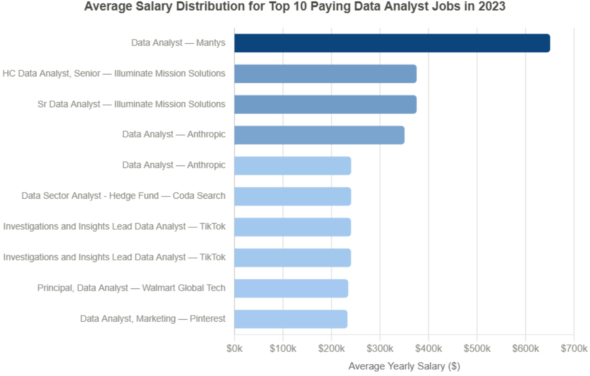
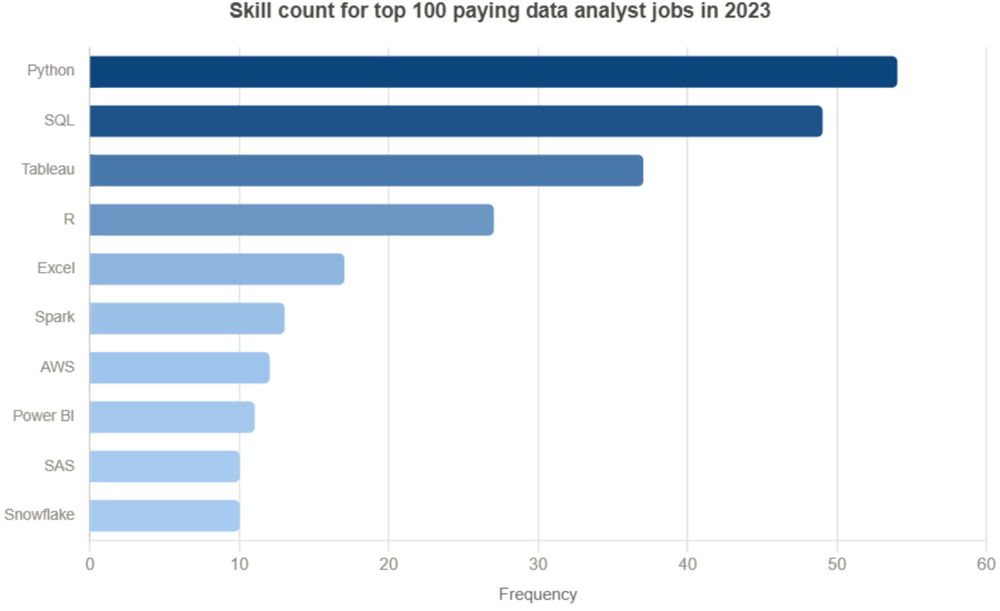

# Introduction
Explore the data analyst job market through SQL analysis of top-paying roles, in-demand skills, and opportunities where high demand meets high salary.

SQL queries? Check them out here: [sql_queries folder](/sql_queries/)

# Background
Driven by a quest to navigate the data analyst job market more effectively, this project was born from a desire to pinpoint top-paid and in-demand skills, streamlining others work to find optimal jobs.

Data hails from my SQL Course. It's packed with insights on job titles, salaries, locations, and essential skills.

### The questions I wanted to answer through my SQL queries were:

1. What are the top-paying data analyst jobs?\
2. What skills are required for these top-paying jobs?\
3. What skills are most in demand for data analysts?\
4. Which skills are associated with higher salaries?\
5. What are the most optimal skills to learn?

# Tools I Used
For my deep dive into the data analyst job market, I harnessed the power of several key tools:

- **SQL**: The backbone of my analysis, allowing me to query the database and find critical insights.
- **PostgreSQL**: The chosen database management system, ideal for handling the job posting data.
- **Visual Studio Code**: My go-to for database management and executing SQL queries.
- **Git & GitHub**: Essential for version control and sharing my SQL scripts and analysis, ensuring collaboration and project tracking.

# The Analysis
Each query for this project aimed at investigating specific
aspects of the data analyst job market.
Here's how I approached each question:

### 1. What are the top-paying data analyst jobs?
To identify the highest-paying roles, I filtered data analyst positions by average annual salary. This query highlights high-paying opportunities in the field.

Query:
```sql
 SELECT
    job_id,
    job_title,
    job_location,
    job_schedule_type,
    salary_year_avg,
    job_posted_date,
    name AS company_name
FROM
    job_postings_fact
LEFT JOIN
    company_dim ON job_postings_fact.company_id = company_dim.company_id
WHERE 
    job_title_short = 'Data Analyst' AND
    job_title ILIKE '%analyst%' AND
    salary_year_avg IS NOT NULL
ORDER BY
    salary_year_avg DESC
LIMIT
    10;
```


*Average Salary Distribution for Top 10 Paying Data Analyst Jobs (2023).*

#### Here's the breakdown of the top data analyst jobs in 2023:
- The top result ($650K, Mantys) is a notable outlier, nearly double the next-highest
  posting; excluding it, high-paying Data Analyst roles range from roughly $232K to $375K.
- Several high-paying positions are associated with senior or specialized titles,
  such as Senior Data Analyst, Principal Data Analyst, and Lead Data Analyst,
  suggesting that experience and scope of responsibility influence compensation.
- High-paying opportunities span multiple industries, including tech (Anthropic,
  TikTok, Pinterest, Walmart), staffing (Coda Search), and government-adjacent
  services (Illuminate Mission Solutions).
- Some extreme salary values may represent specialized roles, unique compensation
  structures, or outliers, so these results are more useful for identifying
  high-paying opportunities rather than defining a typical Data Analyst salary.

### 2. What skills are required for these top-paying jobs?

To identify the skills required for top-paying Data Analyst jobs, I joined the job postings with the skills data.\
This analysis highlights the skills most frequently associated with high-paying roles.
It provides insight into the competencies employers value for higher compensation.

Query:
```sql
WITH
    -- Top 100 highest-paying Data Analyst postings
    top_paying_jobs AS (
        SELECT
            job_id,
            job_title,
            salary_year_avg,
            NAME AS company_name
        FROM
            job_postings_fact
            LEFT JOIN company_dim ON job_postings_fact.company_id = company_dim.company_id
        WHERE
            job_title_short = 'Data Analyst' AND
            salary_year_avg IS NOT NULL
        ORDER BY
            salary_year_avg DESC
        LIMIT
            100
    )
SELECT
    top_paying_jobs.*,
    skills
FROM
    top_paying_jobs
    INNER JOIN skills_job_dim ON top_paying_jobs.job_id = skills_job_dim.job_id 
    INNER JOIN skills_dim ON skills_job_dim.skill_id = skills_dim.skill_id      
ORDER BY
    salary_year_avg DESC;
```


*Skill Frequency in Top 100 Paying Data Analyst Jobs (2023)*

#### Here's the breakdown of the most demanded skills for the top 100 highest paying data analyst jobs in 2023:

- Python is the most in-demand skill, appearing in 54 of the top 100 highest-paying Data Analyst job postings, highlighting its importance for advanced analytics and automation.
- SQL remains a core requirement, with 49 mentions, reinforcing that strong database querying skills are essential even in high-paying roles.
- Tableau ranks third with 37 mentions, indicating that data visualization and business intelligence remain highly valued alongside technical programming skills.
- Beyond the core skills, employers frequently seek expertise in Spark, AWS, Snowflake, and Power BI, suggesting that cloud platforms and big data technologies are increasingly important for higher-paying Data Analyst positions.

### 3. What skills are most in demand for Data Analysts?

This query helped identify the skills most freqently requested in job postings, directing focus to areas with high demand.

Query:
```sql
SELECT skills, count(*) as demand_count
FROM job_postings_fact
INNER JOIN skills_job_dim
    ON job_postings_fact.job_id = skills_job_dim.job_id
INNER JOIN skills_dim
    ON skills_job_dim.skill_id = skills_dim.skill_id
WHERE  job_title_short = 'Data Analyst'
Group by skills
order by demand_count DESC
Limit 10;
```

| Skill | Demand Count |
|---|---:|
| SQL | 92,628 |
| Excel | 67,031 |
| Python | 57,326 |
| Tableau | 46,554 |
| Power BI | 39,468 |
| R | 30,075 |
| SAS | 28,068 |
| PowerPoint | 13,848 |
| Word | 13,591 |
| SAP | 11,297 |

*Table: Skill demand across Data Analyst job postings (top 10)*

#### Here's the breakdown of the most demanded skills for data analysts jobs in 2023:
- SQL is the most in-demand skill for Data Analyst roles, appearing in over 92,000 job postings, reinforcing its role as the core technical requirement for the profession.
- Excel and Python follow closely behind, showing that spreadsheet proficiency remains just as critical as programming ability for Data Analyst roles.
- Tableau and Power BI round out the top 5, highlighting the importance of data visualization and business intelligence skills alongside core technical competencies.
- R, SAS, PowerPoint, Word, and SAP complete the top 10, showing that statistical tools and general office software still play a meaningful role in Data Analyst job requirements.

### 4. Which skills are associated with higher salaries?

Exploring the average salaries associated with skills revealed which skills are the highest paying.

Query:
```sql
SELECT skills, Round(avg(salary_year_avg),0) as avg_salary
FROM job_postings_fact
INNER JOIN skills_job_dim
    ON job_postings_fact.job_id = skills_job_dim.job_id
INNER JOIN skills_dim
    ON skills_job_dim.skill_id = skills_dim.skill_id
WHERE  job_title_short = 'Data Analyst' AND
       salary_year_avg IS NOT NULL
Group by skills
order by avg_salary DESC;
```
| Skill | Average Salary |
|---|---:|
| SVN | $400,000 |
| Solidity | $179,000 |
| Couchbase | $160,515 |
| DataRobot | $155,486 |
| Golang | $155,000 |
| MXNet | $149,000 |
| dplyr | $147,633 |
| VMware | $147,500 |
| Terraform | $146,734 |
| Twilio | $138,500 |

*Table of the average salary for the top 10 paying skills for Data Analysts*

#### Here's a breakdown of the results for top paying skills for Data Analysts:
- Specialized technical skills such as programming languages, cloud platforms, big data technologies, and machine learning tools appear among the highest-paying skills.
- Foundational Data Analyst skills like SQL, Python, and Excel are widely used but generally have lower average salaries compared to niche technologies.
- Some high-paying skills may represent specialized roles or smaller groups of job postings, so salary values should be interpreted alongside demand and job volume.
- The analysis helps identify skills that are associated with higher compensation and can guide future skill development decisions.

### 5. What are the most optimal skills to learn?

Combining demand and salary insights, this analysis identifies skills that offer the strongest balance between market demand and earning potential, helping highlight the most valuable skills for Data Analyst career development.\
**Definition of optimal skills:**  
Skills with demand counts equal to or greater than the average market demand are considered. These skills are then ranked by average salary to identify those with the best combination of availability and earning potential.

Query:
```sql
WITH skill_counts AS (
    SELECT
        skills,
        COUNT(*) AS demand_count,
        ROUND(AVG(salary_year_avg), 0) AS avg_salary
    FROM 
        job_postings_fact
    INNER JOIN skills_job_dim
        ON job_postings_fact.job_id = skills_job_dim.job_id
    INNER JOIN skills_dim
        ON skills_job_dim.skill_id = skills_dim.skill_id
    WHERE
        job_title_short = 'Data Analyst'
        AND salary_year_avg IS NOT NULL
    GROUP BY 
        skills
)
SELECT
    skills,
    avg_salary,
    demand_count
FROM skill_counts
WHERE demand_count >= (
    SELECT AVG(demand_count)
    FROM skill_counts
)
ORDER BY
    avg_salary DESC;
```
| Skill | Average Salary | Demand Count |
|---|---:|---:|
| Spark | $113,002 | 187 |
| Snowflake | $111,578 | 241 |
| Hadoop | $110,888 | 140 |
| Jira | $107,931 | 145 |
| AWS | $106,440 | 291 |
| Alteryx | $105,580 | 124 |
| Azure | $105,400 | 319 |
| Looker | $103,855 | 260 |
| Python | $101,512 | 1,840 |
| Oracle | $100,964 | 332 |
| Java | $100,214 | 135 |
| R | $98,708 | 1,073 |
| Flow | $98,020 | 271 |
| Tableau | $97,978 | 1,659 |
| Go | $97,267 | 288 |
| SQL | $96,435 | 3,083 |
| SQL Server | $96,191 | 336 |
| VBA | $93,845 | 185 |
| SAS | $93,707 | 1,000 |
| SAP | $92,446 | 183 |
| Power BI | $92,324 | 1,044 |
| JavaScript | $91,805 | 153 |
| SSRS | $91,537 | 129 |
| SharePoint | $89,027 | 174 |
| PowerPoint | $88,316 | 524 |
| Excel | $86,419 | 2,143 |
| SPSS | $85,293 | 212 |
| Sheets | $84,130 | 155 |
| Word | $82,941 | 527 |
| Outlook | $80,680 | 180 |

*Table of the most optimal skills for Data Analysts sorted by salary*

#### Here's a breakdown of the most optimal skills for Data Analysts in 2023:
- Specialized technologies such as Spark, Snowflake, and Hadoop rank among the highest-paying skills, while cloud platforms like AWS and Azure provide strong salary potential with consistent demand across Data Analyst roles.
- Python and SQL stand out as high-value skills due to their exceptional demand and competitive salaries, making them strong choices for long-term Data Analyst career development.
- Business intelligence tools such as Tableau and Power BI remain highly relevant, reflecting their importance in reporting, visualization, and decision-making workflows.
- Filtering skills based on demand prevents niche technologies with limited job availability from dominating the results, highlighting skills that provide a better balance between career opportunities and compensation.

# What I Learned
Throughout this project, I strengthened my SQL skills and sharpened my ability to translate a job market question into a working query:

- **Complex query construction**: Practiced writing multi-table joins, CTEs, and subqueries to combine job postings, skills, and company data into a single, coherent analysis.
- **Data aggregation**: Used `GROUP BY`, `COUNT()`, and `AVG()` to summarize demand and salary trends across thousands of postings.
- **Analytical thinking**: Learned to translate a broad question (e.g. "what's optimal to learn?") into a precise, testable SQL definition, then interpret the results critically rather than taking raw numbers at face value.

# Conclusions
### Insights
From the analysis, several general insights emerged about the Data Analyst job market:

1. **Top-paying roles** tend to be senior or specialized positions, spanning industries like tech, staffing, and government-adjacent services, rather than generic entry-level titles.
2. **Skills for top-paying jobs**: Python and SQL dominate even the highest-paying postings, with Tableau and cloud/big-data tools (Spark, AWS, Snowflake) appearing as valuable additions.
3. **Most in-demand skills**: SQL is the clear leader in the Data Analyst job market overall, followed by Excel, Python, and Tableau, showing that core technical and visualization skills remain the baseline expectation.
4. **Skills and salary**: The highest average salaries are tied to niche or specialized tools (e.g. SVN, Solidity, Couchbase), while foundational skills like SQL, Python, and Excel pay less on average despite being far more in demand.
5. **Optimal skills**: Skills like Spark, Snowflake, AWS, Python, and SQL strike the best balance of strong demand and strong pay, making them high-priority targets for skill development.

### Closing Thoughts
This project strengthened my SQL skills and gave practical insight into the Data Analyst job market. The findings from the analysis serve as a guide for prioritizing skill development and job search efforts, helping identify which competencies offer both strong market demand and strong earning potential. Aspiring data analysts can better navigate the job market by focusing on skills that are both in demand and high-paying, based on this analysis.
